<h2>TensorFlow-FlexUNet-Image-Segmentation-BRISC2026-Brain-Tumor (2026/05/06)</h2>
Sarah T.  Arai 
Software Laboratory antillia.com  
This is the first experiment of Image Segmentation for <b>BRISC2026-Brain-Tumor</b> based on our <a href="./src/TensorFlowFlexUNet.py">TensorFlowFlexUNet</a> 
(TensorFlow Flexible UNet Image Segmentation Model for Multiclass) , 
and a 512x512 pixels PNG
<a href="https://drive.google.com/file/d/1ZrUSuT70MUFtq7sUyYAakwZJ9nKPt1RE/view?usp=sharing">
<b>BRISC2026-Brain-Tumor-ImageMask-Dataset.zip</b></a> with colorized masks 
(<a href="https://www.mit.edu/~amini/LICENSE.md">MIT</a>), which was derived by us from   

<a href="https://www.kaggle.com/datasets/vivanrv/briscmat-brain-tumour-mri-dataset-2026/data">
<b>
BriscMat-Brain-Tumour-MRI-Dataset-2026
</a>
 
Deep Learning-Ready Brain MRI Dataset with Tumor Mask Annotations
</b> 
 by Vivan rv.  
On <b>BRISC2025</b>, please refer to our experiment 
<a href="https://github.com/sarah-antillia/TensorFlow-FlexUNet-Image-Segmentation-BRISC2025-BrainTumor">
TensorFlow-FlexUNet-Image-Segmentation-BRISC2025-BrainTumor
</a>
 
 

<b>Actual Image Segmentation for BRISC2026-Brain-Tumor Images of 512x512 pixels </b> 
As shown below, the inferred masks predicted by our segmentation model trained by the dataset 
appear similar to the ground truth masks, but they lack precision in certain areas.
  
<b>class_color_map = {Meningioma:yellow, Glioma:cyan and Pituitary Tumor:mazenta}
</b>
  
<table>
<tr>
<th>Input: image</th>
<th>Mask (ground_truth)</th>
<th>Prediction: inferred_mask</th>
</tr>
<tr>
<td>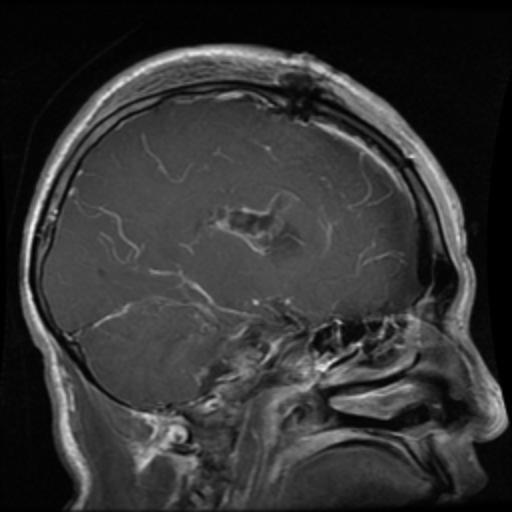</td>
<td>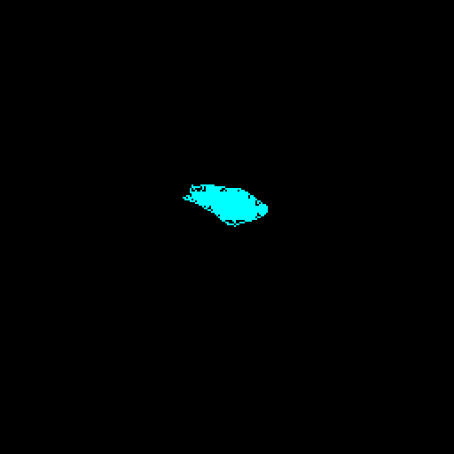</td>
<td></td>
</tr>

<tr>
<td>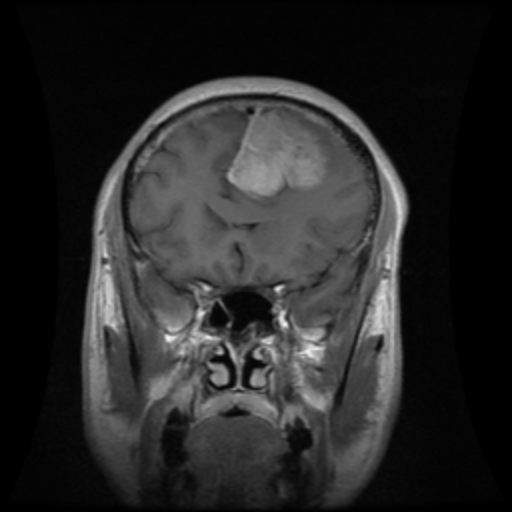</td>
<td>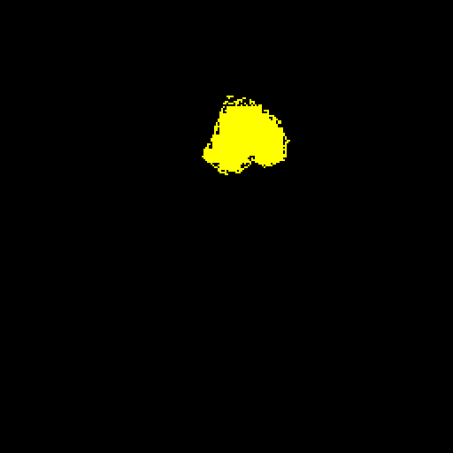</td>
<td></td>
</tr>

<tr>
<td>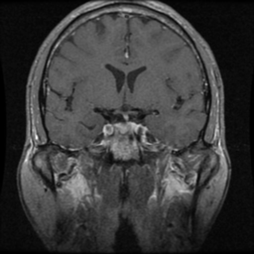</td>
<td></td>
<td>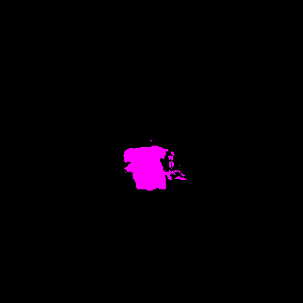</td>
</tr>
</table>

 
<h3>1  Dataset Citation</h3>
The dataset used here was derived from   
<a href="https://www.kaggle.com/datasets/vivanrv/briscmat-brain-tumour-mri-dataset-2026/data">
<b>
BriscMat-Brain-Tumour-MRI-Dataset-2026
</a>
 
Deep Learning-Ready Brain MRI Dataset with Tumor Mask Annotations
</b> 
 by Vivan rv.  
The following explanation was taken from above kaggle web site.
  
<b>About Dataset</b> 
<b>Reference Dataset</b> 
This dataset is derived from the BRISC 2025 Brain Tumor Dataset available on Kaggle: 
<a href="https://www.kaggle.com/datasets/briscdataset/brisc2025">https://www.kaggle.com/datasets/briscdataset/brisc2025</a>
  
The current dataset restructures the original classification 
and segmentation folders into a unified .mat based format for streamlined deep learning workflows.
  
<b>Dataset Description</b> 
This dataset contains 2D brain MRI slices for: 
<ul>
<li>Tumor classification</li>
<li>Tumor segmentation</li>
<li>Multi-view analysis</li>
</ul>
Each sample is stored as an individual .mat file. 
 
<b>Label Category</b> 
0 No Tumor 
1 Meningioma 
2 Glioma 
3 Pituitary Tumor 
4 NonMri 
 
<b>License</b> 
<a href="https://www.mit.edu/~amini/LICENSE.md">MIT</a>
  
<h3>
2 Brain Tumor MRI ImageMask Dataset
</h3>
<h3>2.1 Download BRISC2026-Brain-Tumor ImageMask Dataset</h3>
 If you would like to train this BRISC2026-Brain-Tumor Segmentation model by yourself,
please down load our dataset <a href="https://drive.google.com/file/d/1ZrUSuT70MUFtq7sUyYAakwZJ9nKPt1RE/view?usp=sharing">
<b>BRISC2026-Brain-Tumor-ImageMask-Dataset.zip</b>
</a>
(<a href="https://www.mit.edu/~amini/LICENSE.md">MIT</a>)
 on the google drive,
expand the downloaded, and put it under <b>./dataset/</b> to be.
<pre>
./dataset
└─BRISC2026-Brain-Tumor
    ├─test
    │   ├─images
    │   └─masks
    ├─train
    │   ├─images
    │   └─masks
    └─valid
        ├─images
        └─masks
</pre>
 
<b>BRISC2026-Brain-Tumor Statistics</b> 
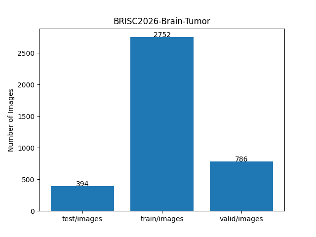 
 
As shown above, the number of images of train and valid datasets is large enough to use for a training set of our segmentation model.
  

<h3>2.2 Derivation of ImageMask Dataset</h3>
The folder structure of the original <b>BriscMat/Train</b> is the following.
It consists of MAT files cotaining image, mask and label data of Brain Tumor three classes (Meningioma, Glioma and Pituitary Tumor) .
<pre>
./BriscMat
  └─Train
       ├─train_1.mat
..
       └─train_6314.mat
</pre>
 
We used a simplye Python script <a href="./generator/ImageMaskDatasetGenerator.py">
ImageMaskDatasetGenerator.py
</a> to generate a 512x512 pixels PNG ImageMask dataset from all pairs of images and their corresponding 
colorizied masks (Meningioma:yellow, Glioma:cyan and Pituitary Tumor:mazenta) from train_*.mat files in Train folder. 
 
 
<h3>2.3 Train Sample Images and Masks</h3>
<b>Train sample images</b> 
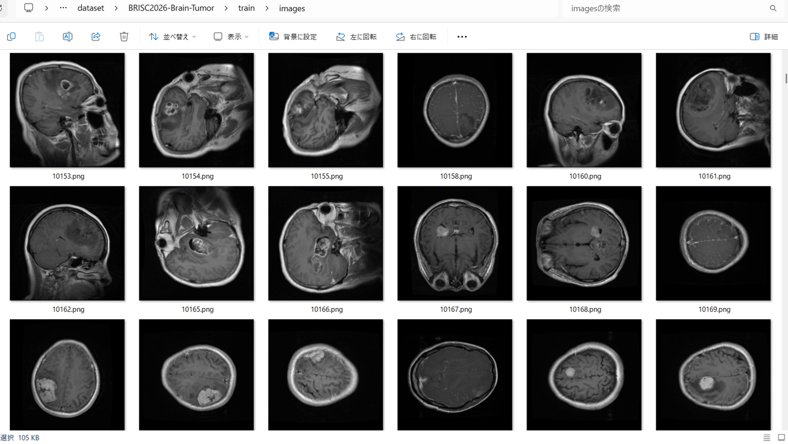
 
<b>Train sample masks</b> 
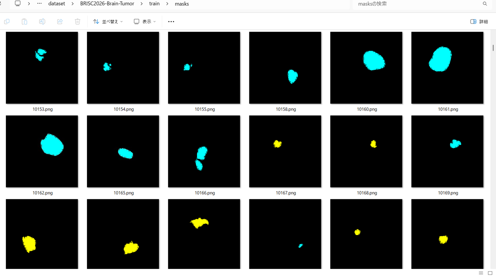
 
<h3>
3 Train TensorflowFlexUNet Model
</h3>
 We trained BRISC2026-Brain-Tumor TensorflowFlexUNet Model by using the following
<a href="./projects/TensorFlowFlexUNet/BRISC2026-Brain-Tumor/train_eval_infer.config"> <b>train_eval_infer.config</b></a> file.  
Please move to ./projects/TensorFlowFlexUNet/BRISC2026-Brain-Tumor and run the following bat file. 
<pre>
>1.train.bat
</pre>
, which simply runs the following command. 
<pre>
>python ../../../src/TensorFlowFlexUNetTrainer.py ./train_eval_infer.config
</pre>

<b>Model parameters</b> 
Defined a small <b>base_filters=16</b> and a large <b>base_kernels=(11,11)</b> for the first Conv Layer of Encoder Block of 
<a href="./src/TensorFlowFlexUNet.py">TensorFlowFlexUNet.py</a> 
and a large <b>num_layers=8</b> (including a bridge between Encoder and Decoder Blocks).
<pre>
[model]
image_width    = 512
image_height   = 512
image_channels = 3
input_normalize = True
normalization  = False
num_classes    = 4
base_filters   = 16
base_kernels  = (11,11)
num_layers    = 8
dropout_rate   = 0.05
dilation       = (1,1)
</pre>

<b>Learning rate</b> 
Defined a small learning rate.  
<pre>
[model]
learning_rate  = 0.00007
</pre>

<b>Loss and metrics functions</b> 
Specified "categorical_crossentropy" and "dice_coef_multiclass". 
<pre>
[model]
loss           = "categorical_crossentropy"
metrics        = ["dice_coef_multiclass"]
</pre>
<b >Learning rate reducer callback</b> 
Enabled learing_rate_reducer callback, and a small reducer_patience.
<pre> 
[train]
learning_rate_reducer = True
reducer_factor     = 0.5
reducer_patience   = 4
</pre>
<b>Early stopping callback</b> 
Enabled early stopping callback with patience parameter.
<pre>
[train]
patience      = 10
</pre>
<b></b> 
<b>RGB color map</b> 
rgb color map dict for BRISC2026-Brain-Tumor 1+3 classes. 
<pre>
[mask]
mask_file_format = ".png"
;BRISC2026-Brain-Tumor 1+3
;                   {Meningioma:yellow, Glioma:cyan, Pituitary Tumor:mazenta}        
rgb_map = {(0,0,0):0, (255,255,0):1, (0,255,0):2, (255,0,255):3,}       
</pre>
<b>Epoch change inference callbacks</b> 
Enabled epoch_change_infer callback. 
<pre>
[train]
epoch_change_infer       = True
epoch_change_infer_dir   =  "./epoch_change_infer"
epoch_changeinfer        = False
epoch_changeinfer_dir    = "./epoch_changeinfer"
num_infer_images         = 6
</pre>
By using this epoch_change_infer callback, on every epoch_change, the inference procedure can be called
 for 6 images in <b>mini_test</b> folder. This will help you confirm how the predicted mask changes 
 at each epoch during your training process.    
As shown below, early in the model training, the predicted masks from our UNet segmentation model showed discouraging results. 
However, as training progressed through the epochs, the predictions gradually improved.  
<b>Epoch_change_inference output at starting (1,2,3)</b> 
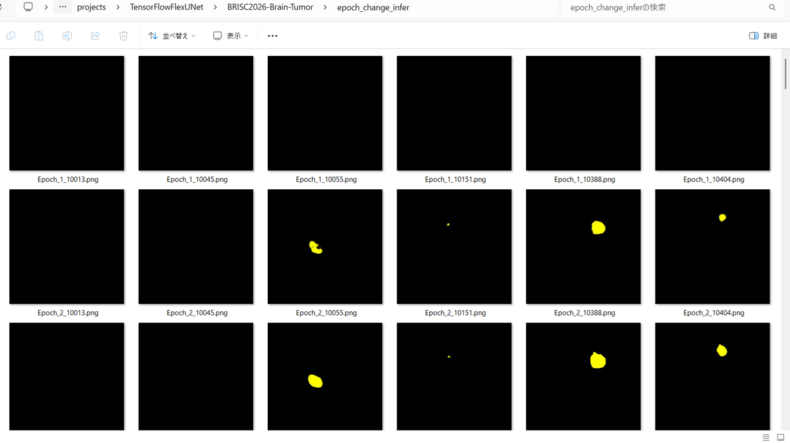 
 
<b>Epoch_change_inference output at middle-point (15,16,17)</b> 
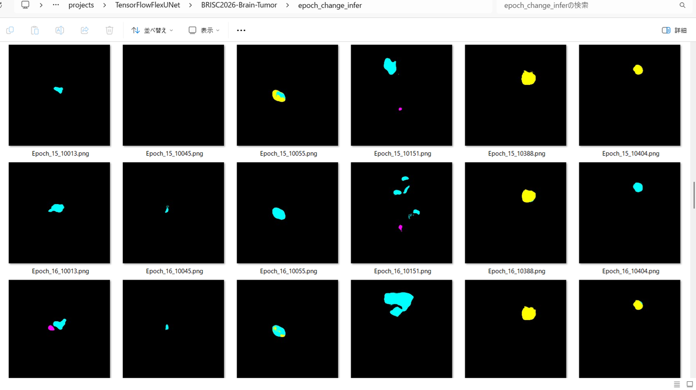 
 
<b>Epoch_change_inference output at ending (32,33,34)</b> 
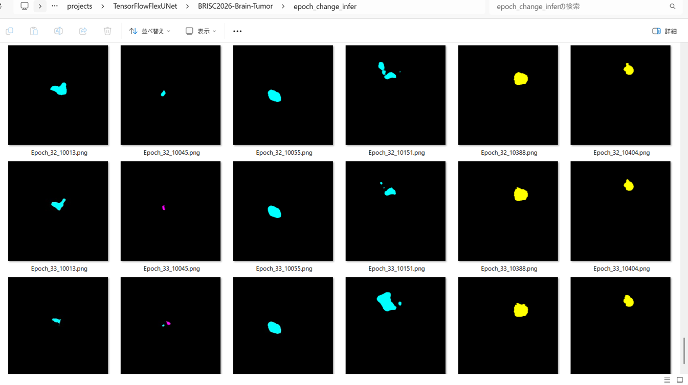 

 
In this experiment, the training process was stopped at epoch 34 by EarlyStoppingCallback.  
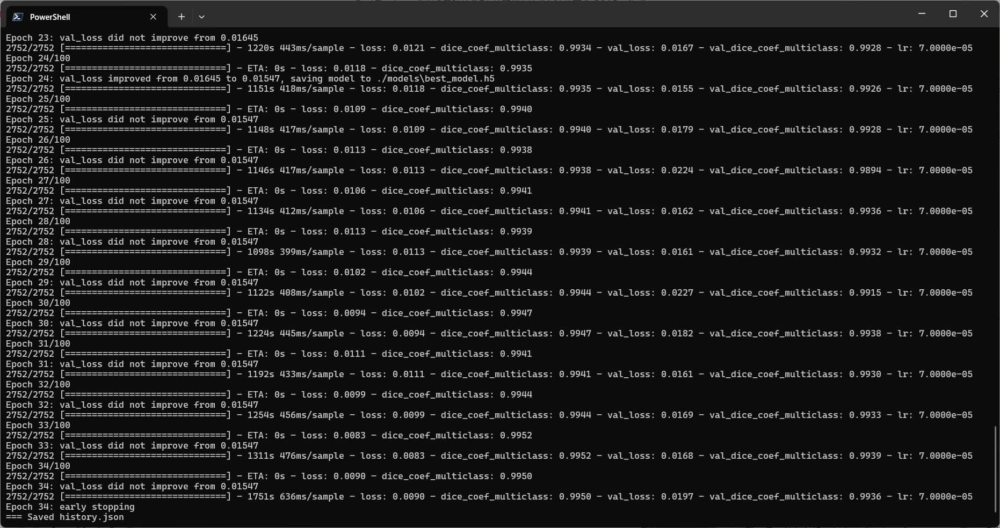 
 
<a href="./projects/TensorFlowFlexUNet/BRISC2026-Brain-Tumor/eval/train_metrics.csv">train_metrics.csv</a> 
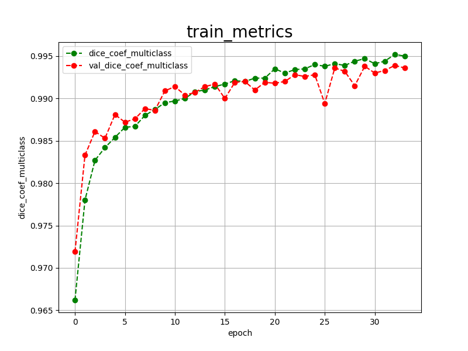 

 
<a href="./projects/TensorFlowFlexUNet/BRISC2026-Brain-Tumor/eval/train_losses.csv">train_losses.csv</a> 
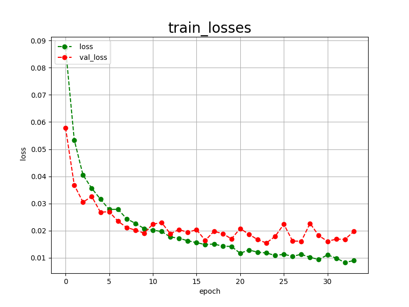 
 
<h3>
4 Evaluation
</h3>
Please move to a <b>./projects/TensorFlowFlexUNet/BRISC2026-Brain-Tumor</b> folder, 
and run the following bat file to evaluate TensorflowFlexUNet model for BRISC2026-Brain-Tumor. 
<pre>
>./2.evaluate.bat
</pre>
This bat file simply runs the following command.
<pre>
>python ../../../src/TensorFlowFlexUNetEvaluator.py  ./train_eval_infer.config
</pre>
Evaluation console output: 
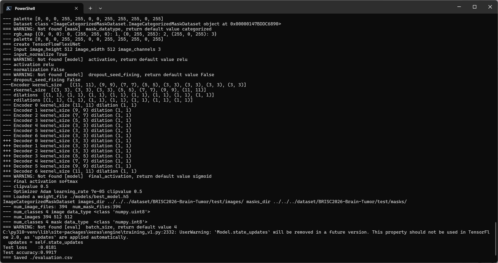
  Image-Segmentation-BRISC2026-Brain-Tumor

<a href="./projects/TensorFlowFlexUNet/BRISC2026-Brain-Tumor/evaluation.csv">evaluation.csv</a> 
The loss (categorical_crossentropy) to this BRISC2026-Brain-Tumor/test was low, and dice_coef_multiclass high as shown below.
 
<pre>
categorical_crossentropy,0.0181
dice_coef_multiclass,0.9917
</pre>
 
<h3>5 Inference</h3>
Please move to a <b>./projects/TensorFlowFlexUNet/BRISC2026-Brain-Tumor</b> folder 
,and run the following bat file to infer segmentation regions for images by the Trained-TensorflowFlexUNet model for BRISC2026-Brain-Tumor. 
<pre>
>./3.infer.bat
</pre>
This simply runs the following command.
<pre>
>python ../../../src/TensorFlowFlexUNetInferencer.py ./train_eval_infer.config
</pre>

<b>mini_test_images</b> 
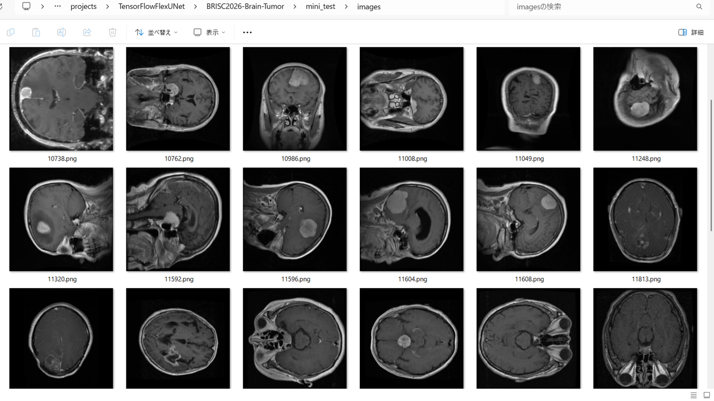 
<b>mini_test_mask(ground_truth)</b> 
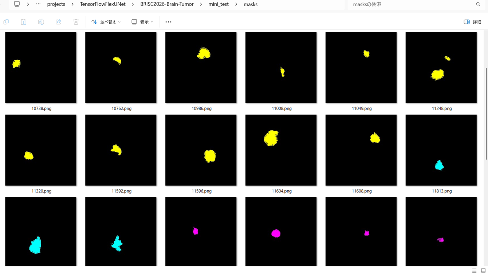 

<b>Inferred test masks</b> 
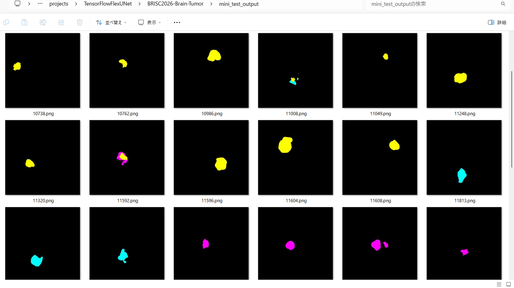 
 

<b>Enlarged images and masks for  BRISC2026-Brain-Tumor Images of 512x512 pixels</b> 
As shown below, the inferred masks predicted by our segmentation model trained by the dataset appear 
similar to the ground truth masks, but they lack precision in certain areas.
  
<b>class_color_map = {Meningioma:yellow, Glioma:cyan, Pituitary Tumor:mazenta}</b>
 
 
<table>
<tr>
<th>Input: image</th>
<th>Mask (ground_truth)</th>
<th>Prediction: inferred_mask</th>
</tr>
<tr>
<td></td>
<td></td>
<td></td>
</tr>

<tr>
<td>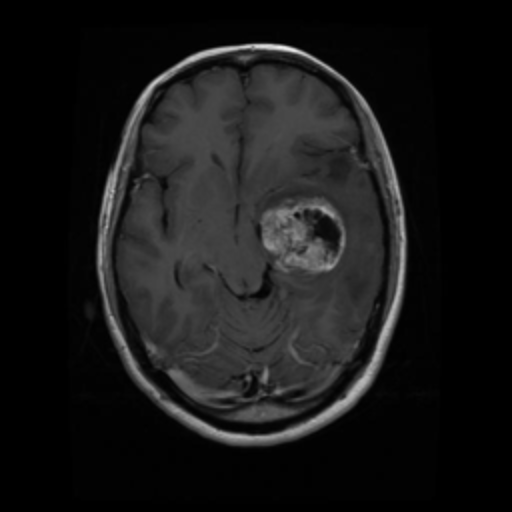</td>
<td></td>
<td></td>
</tr>

<tr>
<td></td>
<td></td>
<td></td>
</tr>
<tr>
<td>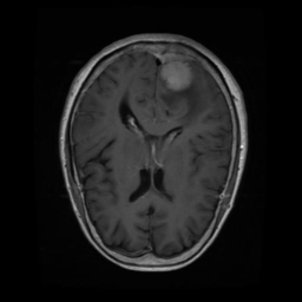</td>
<td></td>
<td></td>
</tr>
<tr>
<td>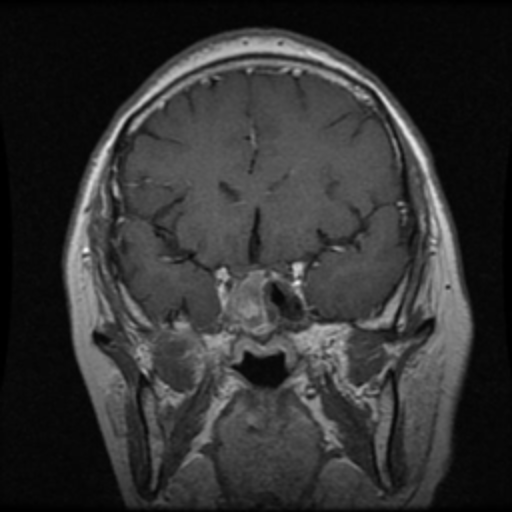</td>
<td></td>
<td></td>
</tr>
<tr>
<td>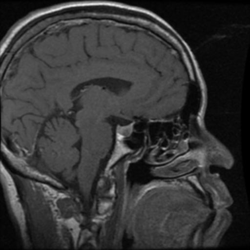</td>
<td></td>
<td></td>
</tr>
</table>

 
<h3>
References
</h3>
<b>1. TensorFlow-FlexUNet-Image-Segmentation-Figshare-BrainTumor</b> 
Toshiyuki Arai  
<a href="https://github.com/sarah-antillia/TensorFlow-FlexUNet-Image-Segmentation-Figshare-BrainTumor">
https://github.com/sarah-antillia/TensorFlow-FlexUNet-Image-Segmentation-Figshare-BrainTumor
</a>
 
 
<b>2. TensorFlow-FlexUNet-Image-Segmentation-Brain-Tumor-MRI</b> 
Toshiyuki Arai  
<a href="https://github.com/sarah-antillia/TensorFlow-FlexUNet-Image-Segmentation-Brain-Tumor-MRI">
https://github.com/sarah-antillia/TensorFlow-FlexUNet-Image-Segmentation-Brain-Tumor-MRI
</a>
 
 
<b>3. TensorFlow-FlexUNet-Image-Segmentation-BRISC2025-BrainTumor</b> 
Toshiyuki Arai  
<a href="https://github.com/sarah-antillia/TensorFlow-FlexUNet-Image-Segmentation-BRISC2025-BrainTumor">
https://github.com/sarah-antillia/TensorFlow-FlexUNet-Image-Segmentation-BRISC2025-BrainTumor
</a>
 
 
<b>4. TensorFlow-FlexUNet-Image-Segmentation-Mixed-Brain-Tumor-MRI-Regenerated</b> 
Toshiyuki Arai  
<a href="https://github.com/sarah-antillia/TensorFlow-FlexUNet-Image-Segmentation-Mixed-Brain-Tumor-MRI-Regenerated">
https://github.com/sarah-antillia/TensorFlow-FlexUNet-Image-Segmentation-Mixed-Brain-Tumor-MRI-Regenerated
</a>
 
 
<b>5. TensorFlow-FlexUNet-Image-Segmentation-Model</b> 
Toshiyuki Arai  
<a href="https://github.com/sarah-antillia/TensorFlow-FlexUNet-Image-Segmentation-Model">
TensorFlow-FlexUNet-Image-Segmentation-Model
</a>
 
 
